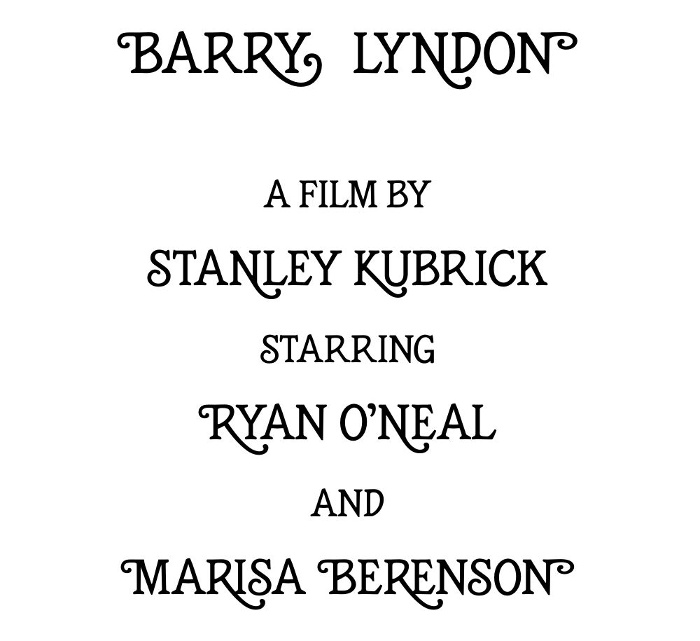

# honoria-font

An Art Deco Font inspired by Stanley Kubrick's Barry Lyndon (1975)

## What is it?
This is a new digital typeface based on the design of the hand-lettered title and text inserts seen in the movie Barry Lyndon (1975). The hand lettering in the movie appears to be the work of Bill Gould. It is reminiscent of designs by Edward Benguiat, especially Bookman Oldstyle with swashes.

Honoria is an all caps font. It does not provide lowercase letters or Arabic numbers (you are encouraged to use Roman numerals instead…). Many of the uppercase letters have character variants with swirls on either side and / or long legs, which you can access through the following OpenType features:

Feature | Variants
------------ | -------------
swsh | variants with curls, tails or long legs (A C G K N R S X Z)
cv01 | swirl on the left (B D E F H K L M N P R U V W Y)
cv02 | swirl on the right (K M N U V W X Y)
cv03 | swirl on the left and long leg (K N R)
cv04 | extra long swirly leg (R)

The character variants with a swirl to the left are meant to be used only in word-initial position, those with a swirl to the right in word-final position. The variants with long legs are pretty limited in their use because of their eccentric shape. Some collisions are unavoidable, so the user will need to decide from case to case where it is appropriate to use them. The variant of R with an extra long swirly leg is the most limited and works pretty much only in paenultimate position when followed by a narrow letter like Y.

Many of the character variants with swashes, curls etc. are from the original design, but I did add a bunch of additional ones. I also supplied some basic punctuation signs and symbols (!, ?, &) and, for the purpose of internationalization, a selection of commonly used accent marks (Á, Ã,  etc.) and special characters (Þ, Ð, Ø, Æ, Œ).

For more samples, have a look at the PDF.

Please report any bugs and issues in the bugtracker.

Made with Glyphs by Luzius Thöny in 2020.

Current version: v1.000b3

## License
This is licensed under the SIL Open Font License 1.1.
